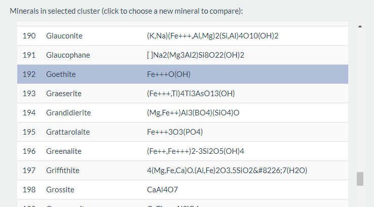
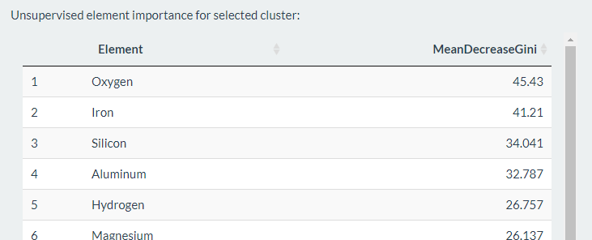

# What is MICA?
*MICA* is a tool that aims to identify and group minerals that have similar chemical compositions.

This is a fairly common problem; the identification of a mineral based on it's chemistry is a difficult task. Hopefully *MICA* can make it a bit easier!

*MICA* is built from the database of minerals at [webmineral.com](www.webmineral.com) which consists of 4722 minerals. The composition of 85 elements for each mineral is recorded in the database. 

### Finding similar minerals
Comparing minerals in 85-dimension space would be an impossible task. So using the UMAP algorithm [(implemented in the uwot R package)](https://github.com/jlmelville/uwot), we reduce the dimensionality of the data to three dimensions. Now that our data is in 3D, we can visually assess similar groups of minerals and identify naturally occuring relationships between groups of minerals.

In it's most basic form, *MICA* looks like this:

*Each dot represents a mineral. The minerals are coloured by their Sulfur and sized by their Copper content*

Each of these individual dots represents one of the 4722 minerals found in the webmineral database.

The quantitative distance between points isn't particularly meaningful due to the highly non-linear nature of the dimension reduction. However, the distance between one point relative to another _is_ meaningful. Minerals that have a small distance between them are more similar than those which are far away.

### Creating natural groups of minerals
We use the [DBSCAN R package](https://github.com/mhahsler/dbscan) to perform density-based clustering on the reduced-dimensionality mineral data. This gives us a bunch of clusters whos consituent minerals have similar chemical compositions.

*MICA* shows you a list of the elements in a selected cluster, along with their associated chemical formulae.

### Importance of elements within clusters
Being able to quickly assess the importance of certain elements within a group of minerals can be informative.

We use the [randomForest R package](https://cran.r-project.org/web/packages/randomForest/index.html) to build an unsupervised random forest model, purely for investigating feature importance. The mean decrease in the Gini index for each element is ranked and displayed.

# How can I use MICA?
*MICA* welcomes you with a landing page. Click *Lets go* to start using the app. There have been some compatibility issues in Internet Explorer, so try something like Chrome, Firefox or the new Edge instead.

### Confusion between minerals
Once you're past the spash screen, you'll be brought to the mineral **Confusion** tab, which will allow you to select a mineral and chose the closest *N* minerals in terms of chemical composition.

On the right, you'll see our 3D reduced-dimension chemical space. You can rotate, pan and zoom using your mouse. Click on a mineral to select that mineral and see what else looks similar.

The following example shows Geothite and the five minerals with most similar compositions.

*Goethite and it's five most similar minerals*

Hover over each mineral in the bar plot to see the quantified composition information.

You can change the visualisation of the 3D display to emphasise the distribution of a particular element. Size and colour are supported.

### Minerals & mineral formulae
If you click on or otherwise select a mineral of interest, the **Minerals** tab will update with the minerals in the same cluster as your selected mineral:

*Minerals and their associated formulae for the selected cluster*

Clicking on a mineral in this list will change the selected mineral.

### Element importance
The mean decrease in Gini index of an unsupervised random forest model results in an understanding of rank of importance of each element for the the selected mineral cluster. Here, we see that Iron, Silicon and Aluminium are driving the selected cluster:

*Important elements for the selected cluster*

