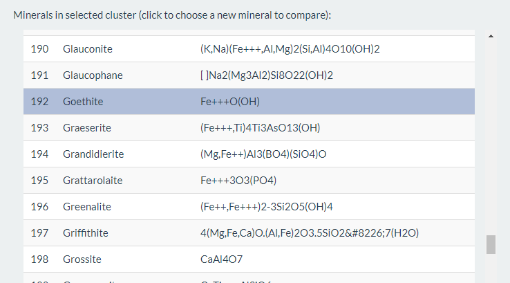

```{r setup, include=FALSE}
knitr::opts_chunk$set(echo = TRUE)
```

### How can I use MICA?
*MICA* welcomes you with a landing page. Click *Lets go* to start using the app. There have been some compatibility issues in Internet Explorer, so try something like Chrome, Firefox or the new Edge instead.

### Confusion between minerals
Once you're past the spash screen, you'll be brought to the mineral **Confusion** tab, which will allow you to select a mineral and chose the closest *N* minerals in terms of chemical composition.

On the right, you'll see our 3D reduced-dimension chemical space. You can rotate, pan and zoom using your mouse. Click on a mineral to select that mineral and see what else looks similar.

The following example shows Geothite and the five minerals with most similar compositions.

<center>

*Goethite and it's five most similar minerals*
</center>

Hover over each mineral in the bar plot to see the quantified composition information.

You can change the visualisation of the 3D display to emphasise the distribution of a particular element. Size and colour are supported.

### Minerals & mineral formulae
If you click on or otherwise select a mineral of interest, the **Minerals** tab will update with the minerals in the same cluster as your selected mineral:

<center>

*Minerals and their associated formulae for the selected cluster*
</center>

Clicking on a mineral in this list will change the selected mineral.

### Element importance
The mean decrease in Gini index of an unsupervised random forest model results in an understanding of rank of importance of each element for the the selected mineral cluster. Here, we see that Iron, Silicon and Aluminium are driving the selected cluster:

<center>

*Important elements for the selected cluster*
</center>